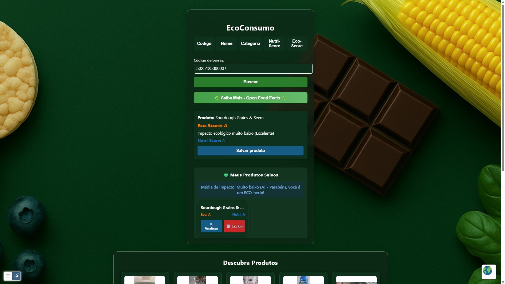
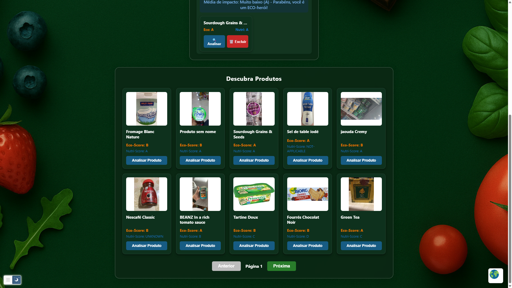

# COLÉGIOS UNIVAP - UNIDADE CENTRO

## PROJETO- EcoConsumo- Avaliação de Produtos Sustentáveis 

Este documento apresenta a documentação do projeto EcoConsumo, desenvolvido durante o hackathon de 2025, organizado pela UNIVAP CENTRO. O projeto teve como objetivo solucionar problemas ambientais, buscando criar uma solução inovadora para o problema.

Sua finalidade é desenvolver o uso da tecnologia para solucionar desafios relacionados à ODS 13- Ação Contra a Mudança Global do Clima.
A ODS 13 propõe adotar medidas urgentes para combater as mudanças climáticas e seus impactos. Isso inclui reduzir emissões de gases de efeito estufa, fortalecer a resiliência a
eventos climáticos extremos e promover a educação e conscientização sobre a crise climática.



# Paginação da API



A escolha do tema justifica-se pelo seu potencial de contribuição para o desenvolvimento de um mercado mais sustentável, bem como pela possibilidade de implementação prática em redes de supermercados.

# EcoConsumo API — Especificação (proposta)

> **Escopo**: esta especificação propõe uma API REST para atender as funcionalidades expostas na interface do EcoConsumo (busca por **código de barras**, **nome**, **categoria**, **Nutri‑Score**, **Eco‑Score**, gestão de **produtos salvos** e **média de impacto**; além de integração opcional com **mapa** de locais). A UI observada sugere consumo de dados de produtos alimentares (ex.: código de barras) e filtros por scores nutricionais/ambientais.

> **Status**: Rascunho v0.1

---

## Convenções

* **Base URL (exemplo)**: `https://api.ecoconsumo.example.com`
* **Formato**: JSON (`application/json; charset=utf-8`)
* **Autenticação**: Bearer Token via `Authorization: Bearer <token>`
* **Versionamento**: via header `Accept: application/vnd.ecoconsumo.v1+json` ou prefixo `/v1`
* **Paginação**: `page` (1..N), `pageSize` (1..100, padrão 20); resposta inclui `meta` com `total`, `page`, `pageSize`
* **Ordenação**: `sort` com `campo` e `-campo` para descendente (ex.: `sort=-updatedAt`)
* **Rate limit**: headers `X-RateLimit-Limit`, `X-RateLimit-Remaining`, `Retry-After`

---

## Recursos

### Produto

Representa um item consultável por código de barras ou outros filtros.

```json
{
  "barcode": "7891234567890",
  "name": "Iogurte Natural Integral",
  "brand": "Marca X",
  "categories": ["Laticínios", "Iogurtes"],
  "imageUrl": "https://.../produto.jpg",
  "nutriScore": "B",
  "ecoScore": "A",
  "nutrients": {
    "energy_kj": 260,
    "fat_g": 3.2,
    "saturated_fat_g": 2.0,
    "sugars_g": 4.5,
    "salt_g": 0.1
  },
  "eco": {
    "co2_kg": 0.65,
    "water_l": 120,
    "land_use_m2yr": 0.3
  },
  "origin": "BR",
  "packaging": ["plástico", "papel"],
  "labels": ["orgânico"],
  "externalLink": "https://.../produtos/7891234567890",
  "updatedAt": "2025-08-01T12:34:56Z"
}
```

### SavedProduct (Produto Salvo)

```json
{
  "userId": "usr_123",
  "barcode": "7891234567890",
  "savedAt": "2025-08-18T10:00:00Z",
  "notes": "Comprar novamente"
}
```

---

## Endpoints

### 1) Buscar por código de barras

`GET /v1/products/{barcode}`

**Path params**

* `barcode` (string, obrigatório) — EAN/UPC.

**Resposta 200** — `Product`

```json
{
  "data": { /* Product */ }
}
```

**Erros**: `404` (não encontrado), `400` (barcode inválido)

**Exemplo**

```bash
curl -H "Authorization: Bearer $TOKEN" \
  https://api.ecoconsumo.example.com/v1/products/7891234567890
```

---

### 2) Listar/filtrar produtos

`GET /v1/products`

**Query params** (todos opcionais)

* `q` — termo livre (nome/marca)
* `category` — ex.: `Laticínios`
* `nutriScore` — `A|B|C|D|E` (aceita múltiplos: `nutriScore=A,B`)
* `ecoScore` — `A|B|C|D|E` (aceita múltiplos)
* `page`, `pageSize` — paginação
* `sort` — ex.: `sort=-updatedAt` | `sort=name`

**Resposta 200**

```json
{
  "data": [ /* Product[] */ ],
  "meta": {"total": 123, "page": 1, "pageSize": 20}
}
```

**Exemplos**

```bash
# por nome
curl -G -H "Authorization: Bearer $TOKEN" \
  --data-urlencode "q=iogurte natural" \
  https://api.ecoconsumo.example.com/v1/products

# por categoria + Nutri-Score + Eco-Score
curl -G -H "Authorization: Bearer $TOKEN" \
  --data-urlencode "category=Snacks" \
  --data-urlencode "nutriScore=A,B" \
  --data-urlencode "ecoScore=A" \
  https://api.ecoconsumo.example.com/v1/products
```

---

### 3) Produtos salvos do usuário — listar

`GET /v1/users/{userId}/saved-products`

**Resposta 200**

```json
{
  "data": [ /* SavedProduct[] */ ]
}
```

### 4) Salvar um produto

`POST /v1/users/{userId}/saved-products`

**Body**

```json
{
  "barcode": "7891234567890",
  "notes": "Comprar em promoção"
}
```

**Resposta 201** — SavedProduct

### 5) Remover produto salvo

`DELETE /v1/users/{userId}/saved-products/{barcode}`

**Resposta 204** (sem corpo)

---

### 6) Média de impacto (produtos salvos)

`GET /v1/users/{userId}/impact/average`

Calcula métricas médias (ou ponderadas) com base nos produtos salvos.

**Query params opcionais**

* `since` (ISO8601) — considerar itens desde a data.
* `until` (ISO8601) — considerar itens até a data.

**Resposta 200**

```json
{
  "data": {
    "count": 8,
    "nutriScoreDistribution": {"A": 3, "B": 2, "C": 2, "D": 1, "E": 0},
    "ecoScoreDistribution": {"A": 4, "B": 3, "C": 1, "D": 0, "E": 0},
    "eco": {
      "avg_co2_kg": 0.78,
      "avg_water_l": 95.1,
      "avg_land_use_m2yr": 0.25
    }
  }
}
```

---

### 7) Locais próximos (para mapa opcional)

`GET /v1/stores/nearby`

**Query params**

* `lat` (obrigatório), `lng` (obrigatório)
* `radiusMeters` (padrão 3000)
* `category` (opcional), `brand` (opcional)

**Resposta 200**

```json
{
  "data": [
    {
      "id": "sto_001",
      "name": "Mercado Central",
      "location": {"lat": -23.56, "lng": -46.63},
      "address": "Av. Exemplo, 100 - Centro",
      "opensAt": "08:00",
      "closesAt": "21:00"
    }
  ]
}
```

---

### 8) Saúde do serviço

`GET /v1/health`

**Resposta 200**

```json
{"status": "ok", "time": "2025-08-19T12:00:00Z"}
```

---

## Códigos de erro

* `400 Bad Request` — parâmetros inválidos, formatos incorretos
* `401 Unauthorized` — token ausente/inválido
* `403 Forbidden` — credenciais sem permissão
* `404 Not Found` — recurso inexistente
* `409 Conflict` — duplicidade (ex.: produto já salvo)
* `429 Too Many Requests` — limite atingido
* `500/502/503` — erros do servidor/dependências

**Formato de erro**

```json
{
  "error": {
    "code": "invalid_param",
    "message": "O campo nutriScore deve ser um de A,B,C,D,E",
    "details": [{"field": "nutriScore", "value": "Z"}]
  }
}
```

---

## Segurança

* **Auth**: Bearer JWT ou chave de API por projeto
* **TLS**: obrigatório (HTTPS)
* **Registros**: auditoria de operações sensíveis (salvar/remover)
* **CORS**: liberar domínios do frontend (ex.: `https://app.ecoconsumo.example`)

---

## Mapas de campos \u2192 UI (rastreabilidade)

* **Aba "Código"** → `GET /v1/products/{barcode}`
* **Abas "Nome", "Categoria"** → `GET /v1/products?q=...&category=...`
* **Abas "Nutri‑Score", "Eco‑Score"** → `GET /v1/products?nutriScore=...&ecoScore=...`
* **Área "Meus Produtos Salvos"** → `GET/POST/DELETE /v1/users/{userId}/saved-products`
* **"Média de Impacto"** → `GET /v1/users/{userId}/impact/average`
* **Mapa (iframe)** → `GET /v1/stores/nearby`

---

## Exemplos de uso (cURL)

```bash
# 1) Buscar por código de barras
curl -s -H "Authorization: Bearer $TOKEN" \
  https://api.ecoconsumo.example.com/v1/products/7891234567890 | jq

# 2) Listar por filtros
curl -s -G -H "Authorization: Bearer $TOKEN" \
  --data-urlencode "q=chocolate amargo" \
  --data-urlencode "ecoScore=A,B" \
  --data-urlencode "page=1" --data-urlencode "pageSize=20" \
  https://api.ecoconsumo.example.com/v1/products | jq

# 3) Salvar produto
curl -s -X POST -H "Authorization: Bearer $TOKEN" \
  -H "Content-Type: application/json" \
  -d '{"barcode":"7891234567890","notes":"Preferir 70% cacau"}' \
  https://api.ecoconsumo.example.com/v1/users/usr_123/saved-products | jq

# 4) Remover produto salvo
curl -s -X DELETE -H "Authorization: Bearer $TOKEN" \
  https://api.ecoconsumo.example.com/v1/users/usr_123/saved-products/7891234567890 -i

# 5) Média de impacto
curl -s -G -H "Authorization: Bearer $TOKEN" \
  --data-urlencode "since=2025-08-01T00:00:00Z" \
  https://api.ecoconsumo.example.com/v1/users/usr_123/impact/average | jq
```

---

## OpenAPI 3.0 (YAML)

```yaml
openapi: 3.0.3
info:
  title: EcoConsumo API
  version: 0.1.0
servers:
  - url: https://api.ecoconsumo.example.com/v1
paths:
  /products/{barcode}:
    get:
      summary: Buscar produto por código de barras
      parameters:
        - in: path
          name: barcode
          required: true
          schema: { type: string }
      responses:
        '200':
          description: OK
          content:
            application/json:
              schema:
                type: object
                properties:
                  data: { $ref: '#/components/schemas/Product' }
        '404': { description: Não encontrado }
  /products:
    get:
      summary: Listar/filtrar produtos
      parameters:
        - in: query
          name: q
          schema: { type: string }
        - in: query
          name: category
          schema: { type: string }
        - in: query
          name: nutriScore
          schema:
            type: string
            example: A,B
        - in: query
          name: ecoScore
          schema:
            type: string
            example: A
        - in: query
          name: page
          schema: { type: integer, minimum: 1, default: 1 }
        - in: query
          name: pageSize
          schema: { type: integer, minimum: 1, maximum: 100, default: 20 }
        - in: query
          name: sort
          schema: { type: string }
      responses:
        '200':
          description: OK
          content:
            application/json:
              schema:
                type: object
                properties:
                  data:
                    type: array
                    items: { $ref: '#/components/schemas/Product' }
                  meta:
                    type: object
                    properties:
                      total: { type: integer }
                      page: { type: integer }
                      pageSize: { type: integer }
  /users/{userId}/saved-products:
    get:
      summary: Listar produtos salvos
      parameters:
        - in: path
          name: userId
          required: true
          schema: { type: string }
      responses:
        '200':
          description: OK
          content:
            application/json:
              schema:
                type: object
                properties:
                  data:
                    type: array
                    items: { $ref: '#/components/schemas/SavedProduct' }
    post:
      summary: Salvar produto
      parameters:
        - in: path
          name: userId
          required: true
          schema: { type: string }
      requestBody:
        required: true
        content:
          application/json:
            schema:
              type: object
              properties:
                barcode: { type: string }
                notes: { type: string }
              required: [barcode]
      responses:
        '201':
          description: Criado
          content:
            application/json:
              schema: { $ref: '#/components/schemas/SavedProduct' }
  /users/{userId}/saved-products/{barcode}:
    delete:
      summary: Remover produto salvo
      parameters:
        - in: path
          name: userId
          required: true
          schema: { type: string }
        - in: path
          name: barcode
          required: true
          schema: { type: string }
      responses:
        '204': { description: Sem conteúdo }
  /users/{userId}/impact/average:
    get:
      summary: Estatísticas médias de impacto
      parameters:
        - in: path
          name: userId
          required: true
          schema: { type: string }
        - in: query
          name: since
          schema: { type: string, format: date-time }
        - in: query
          name: until
          schema: { type: string, format: date-time }
      responses:
        '200':
          description: OK
          content:
            application/json:
              schema:
                type: object
                properties:
                  data:
                    type: object
                    properties:
                      count: { type: integer }
                      nutriScoreDistribution:
                        type: object
                        additionalProperties: { type: integer }
                      ecoScoreDistribution:
                        type: object
                        additionalProperties: { type: integer }
                      eco:
                        type: object
                        properties:
                          avg_co2_kg: { type: number }
                          avg_water_l: { type: number }
                          avg_land_use_m2yr: { type: number }
  /stores/nearby:
    get:
      summary: Locais próximos
      parameters:
        - in: query
          name: lat
          required: true
          schema: { type: number, format: double }
        - in: query
          name: lng
          required: true
          schema: { type: number, format: double }
        - in: query
          name: radiusMeters
          schema: { type: integer, default: 3000 }
        - in: query
          name: category
          schema: { type: string }
        - in: query
          name: brand
          schema: { type: string }
      responses:
        '200':
          description: OK
          content:
            application/json:
              schema:
                type: object
                properties:
                  data:
                    type: array
                    items:
                      type: object
                      properties:
                        id: { type: string }
                        name: { type: string }
                        location:
                          type: object
                          properties:
                            lat: { type: number }
                            lng: { type: number }
                        address: { type: string }
                        opensAt: { type: string }
                        closesAt: { type: string }
  /health:
    get:
      summary: Saúde do serviço
      responses:
        '200': { description: OK }
components:
  schemas:
    Product:
      type: object
      properties:
        barcode: { type: string }
        name: { type: string }
        brand: { type: string }
        categories:
          type: array
          items: { type: string }
        imageUrl: { type: string, format: uri }
        nutriScore: { type: string, enum: [A,B,C,D,E] }
        ecoScore: { type: string, enum: [A,B,C,D,E] }
        nutrients:
          type: object
          properties:
            energy_kj: { type: number }
            fat_g: { type: number }
            saturated_fat_g: { type: number }
            sugars_g: { type: number }
            salt_g: { type: number }
        eco:
          type: object
          properties:
            co2_kg: { type: number }
            water_l: { type: number }
            land_use_m2yr: { type: number }
        origin: { type: string }
        packaging:
          type: array
          items: { type: string }
        labels:
          type: array
          items: { type: string }
        externalLink: { type: string, format: uri }
        updatedAt: { type: string, format: date-time }
    SavedProduct:
      type: object
      properties:
        userId: { type: string }
        barcode: { type: string }
        savedAt: { type: string, format: date-time }
        notes: { type: string }
security:
  - bearerAuth: []
components:
  securitySchemes:
    bearerAuth:
      type: http
      scheme: bearer
      bearerFormat: JWT
```

---

## Checklist de implementação

* [ ] Definir fonte de dados de produtos (catálogo próprio e/ou integração a base pública)
* [ ] Implementar normalização de Nutri‑Score/Eco‑Score
* [ ] Cálculo de métricas médias e distribuições
* [ ] Persistência para produtos salvos (por usuário)
* [ ] Índices de busca (nome, categoria, código)
* [ ] Observabilidade (logs estruturados, métricas, tracing)
* [ ] Testes de contrato (OpenAPI), unitários e e2e
* [ ] Política de CORS e limites por origem

---

## Observações

* Caso o frontend também consuma uma **API pública de alimentos** por código de barras, esta API pode atuar como **BFF** (Backend‑for‑Frontend): agregando/normalizando resultados, aplicando cache e enriquecendo com métricas de impacto ambiental.
* Campos e exemplos acima são ilustrativos; ajuste conforme o modelo de dados real do seu catálogo.

# Integrantes:  
- Alícia Lanza Pacheco
-Caio Souza Alves
-Enzo Raphael Boquimpani de Moura Nascimento
-Leonardo Martinelli de Oliveira Lima
-Lucas Marassi Cipriano Pereira
-Manuella de Oliveira
-Maria Lúcia Souza Pinto
-Mário Guimarães Borrel
-Murilo Gonçalves de Lima
-Téo Camargo Barbosa Pádua
